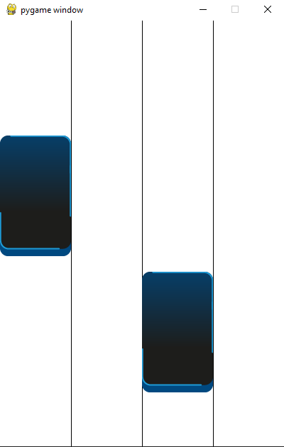
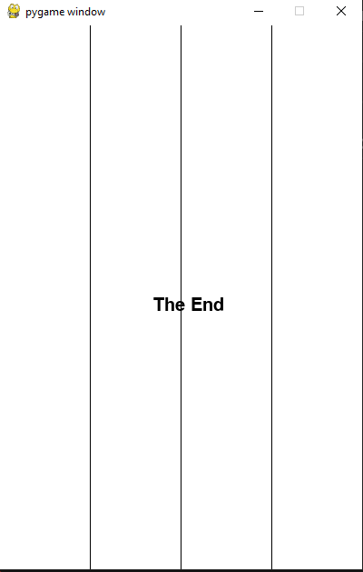
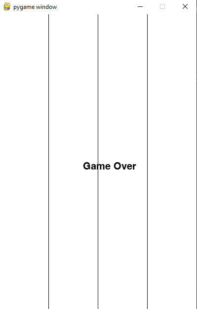

# Игра "Рояль"
Игра наподобие Piano tiles, в которой нужно успевать кликать по нотам так, чтобы получилась цельная мелодия. Написана на библиотеке pygame.
## Чему я научился
- Деление большого проекта на файлы, классы, функции.
- Управление большим количеством проектов.
- Деление игры на разные состояния (на игру и меню) и управление ими через структурные единицы
## Работа проекта
### Меню игры

### Игра

### Победа

### Поражение
